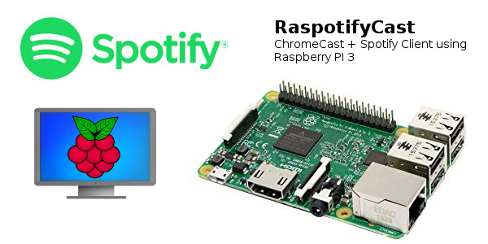
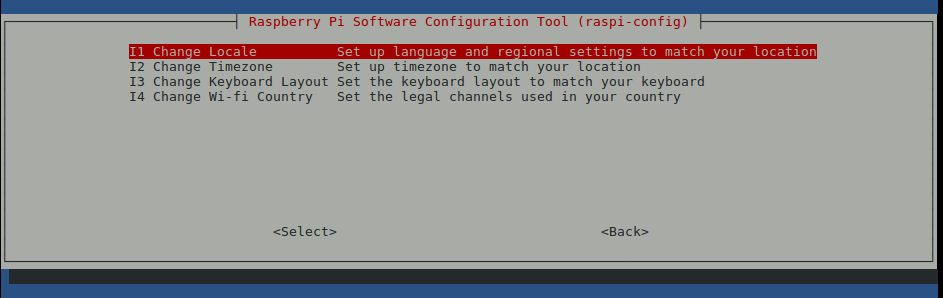
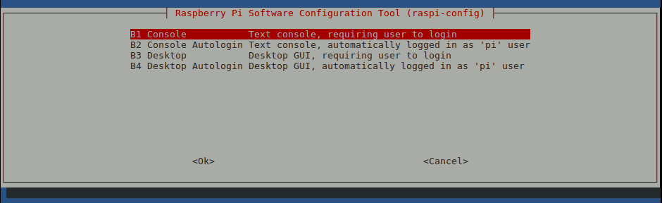
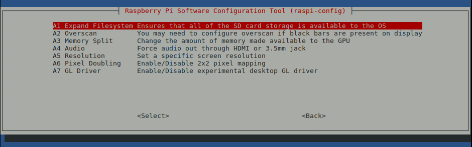

# RaspotifyCast

## Description
This project shows the necessary process to use a **Raspberry PI 3** as a **ChromeCast** + **Spotify** client.

## Necessary packages & acknowledges:

1) [RaspiCast](https://play.google.com/store/apps/details?id=at.huber.raspicast&hl=es)
2) [OMXV](git clone https://github.com/HaarigerHarald/omxiv)
2) [Raspotify](https://github.com/dtcooper/raspotify)

## PART 1: SETTING THE RASPBERRY

#### QUICK Setup (Ethernet connection necessary)

1) Just donwnload the already baked SD Card image in: [link](https://drive.google.com/file/d/1Crr6sQo4ctdwvLYwC_VjfvZpphWRlgVF/view?usp=sharing)
2) Download ETCHER to burn de image into SD Card: [link](https://etcher.io/)
3) Burn the image into SD Card.
4) Connect the Raspberry to TV via HDMI and to network via Ethernet Cable.
5) The RapotifyCast should be accesible via ssh by doing: 'ssh pi@raspofifycast.local' (password: "raspberry")

#### AUTOMATIC Setup (Ethernet or Wifi)
Still under work.

#### MANUAL Setup (Ethernet or Wifi)

1) Download Raspbian-Lite Image: [Raspbian-Lite](https://downloads.raspberrypi.org/raspbian_lite_latest)
2) Download ETCHER to burn de image into SD Card: [link](https://etcher.io/)
3) Burn the image into SD Card.
4) Open the SD Card in your machine and open **Boot** partition.
5) Add an empty file called **ssh** and save it.
6) Download the file [**wpa_supplicant.conf**](files/wpa_supplicant.conf).
7) Edit **wpa_supplicant.conf** setting your WIFI network parameters 'SSID_NAME" and "PASSWORD" and save it in **Boot** partition.
8) Extract securely SD Card, insert it into your Raspberry and power it on.
9) Connect to Raspberry via **SSH**. Open a terminal and enter: 'ssh pi@raspberrypi.local"
10) Type: 
sudo apt-get update
sudo apt-get upgrade
sudo apt-get dist-upgrade

11) Change Raspberry settings via **Raspi-Config**. Type: 'sudo raspi-config'.

  a. Change Localization settings to your country.
  
  
  
  b. Change Boot settings to "Command Line with user Password".
  
  
  
  c. Enter in advance settings and expand filesystem to the whole SD Card.
  
  
  
  d. Enter in network options and change "Hostname" to **RaspotifyCast".
  
12) Reboot. Type 'sudo reboot'.

13) Wait for 1 minute and try to connect again, this time typing: ssh pi@raspotifycast.local

14) Install **Raspotify**: 'curl -sL https://dtcooper.github.io/raspotify/install.sh | sh'

15) Install **Git**: 'sudo apt-get install git'

16) Clone **OpenMAX Image Viewer**: 'cd ~ && git clone https://github.com/HaarigerHarald/omxiv.git'

17) Install necessary packages: 'sudo apt-get install libjpeg8-dev libpng12-dev'

17) Build & Install it: 'cd omxiv && make ilclient && make && sudo make install'

18) Reboot & Ready!!

## PART 2: INSTALLING THE APP IN YOUR ANDROID PHONE

1) Go to **Google Play Store** and download [RaspiCast](https://play.google.com/store/apps/details?id=at.huber.raspicast&hl=es)

2) Open it.

3) Go to Settings and set following parameters:

4) You should be able to send content to your TV via RaspotifyCast!

